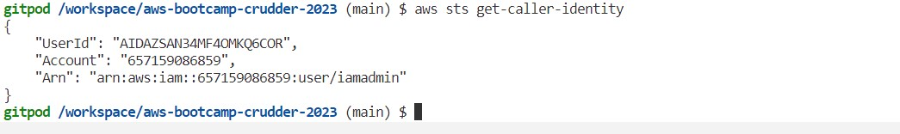
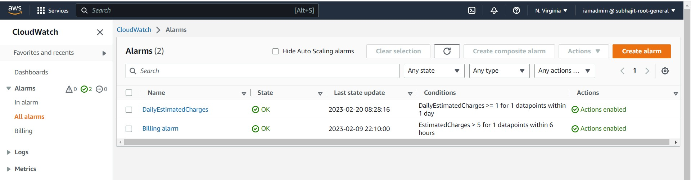
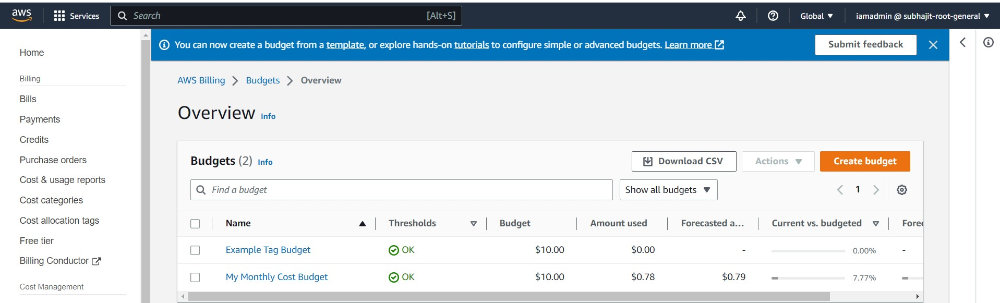

# Week 0 — Billing and Architecture

## Getting the AWS CLI Working

Installed AWS CLI and configured it with my IAM User Credentials.

Updated my `.gitpod.yml` to include the following task.

```sh
tasks:
  - name: aws-cli
    env:
      AWS_CLI_AUTO_PROMPT: on-partial
    init: |
      cd /workspace
      curl "https://awscli.amazonaws.com/awscli-exe-linux-x86_64.zip" -o "awscliv2.zip"
      unzip awscliv2.zip
      sudo ./aws/install
      cd $THEIA_WORKSPACE_ROOT
```

### Create a new User and Generate AWS Credentials




### Add a billing alarm

Added cloudwatch billing alarm


### Add a budget

Added cloudwatch billing alarm


### Lucidchart Napkin Diagram

Created Lucid Chart Napkin Diagram


### Logical Architecture Diagram

Created Lucid Chart Architectural Diagram


